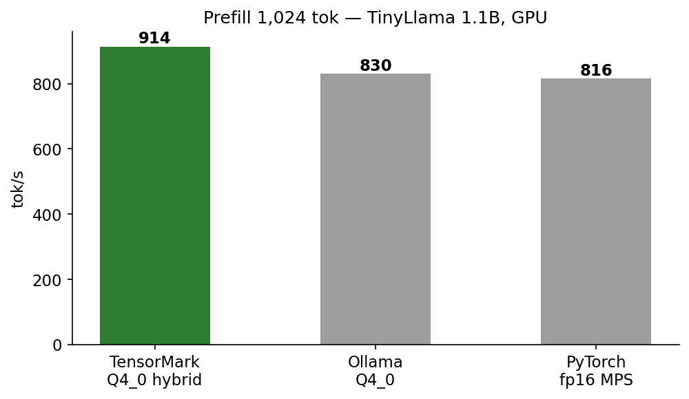
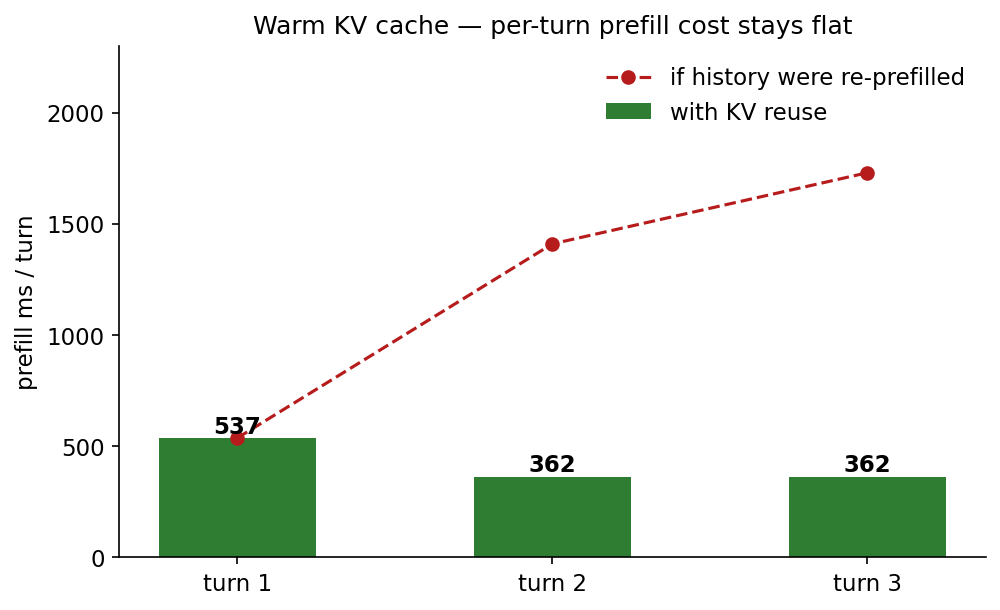
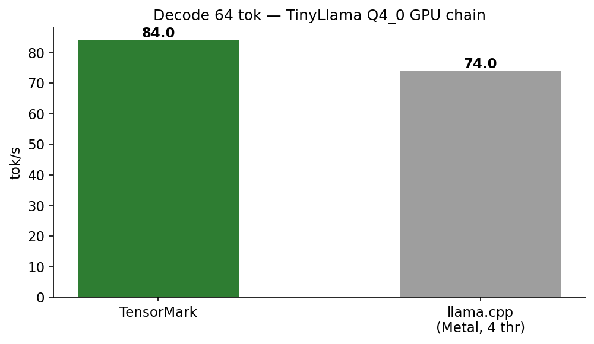
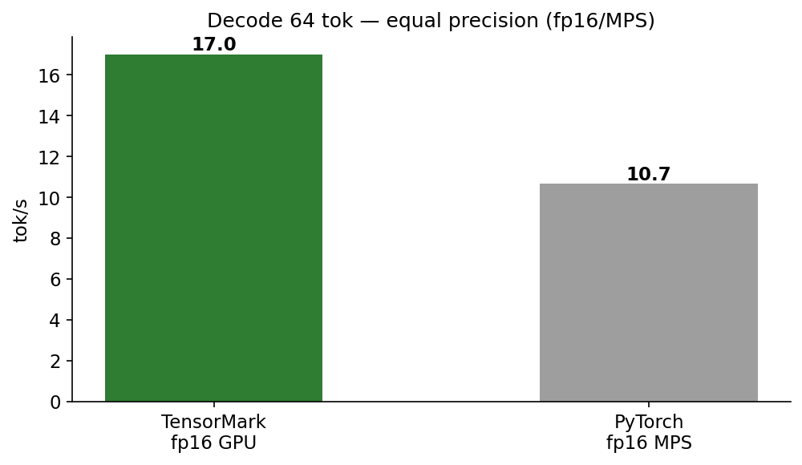

# TensorMark

**A focused C++23 neural engine with a PyTorch-compatible Python subset, built
for Apple Silicon.**


---

## What this is

TensorMark is two things in one repository:

1. **A neural engine for Apple Silicon** — a header-only C++23 library for
   training and running neural networks, tuned for the unified-memory
   architecture of Apple's M-series chips.
2. **A drop-in PyTorch-compatible Python layer** — swap `import torch` for
   `import tensormark.torch as torch` and keep the same training loop, backed
   by the native engine.

It is developed and validated on an Apple M1 MacBook with **8 GB of unified
memory**, and that machine is the design brief. On unified memory there is no
separate GPU RAM to hide in: the engine shares every gigabyte with the
operating system, the browser, and your Python process. TensorMark treats that
as a first-class constraint — bounded allocations, buffer recycling, and
bandwidth-aware kernels — rather than an afterthought.

- **Zero heavyweight dependencies** — no CUDA, no external accelerator
  runtime; NumPy is the only Python runtime dependency.
- **Drop-in PyTorch subset** — swap the import, keep the training loop.
- **LLM inference on-device** — header-only C++23 engine with GPU (Metal)
  decode and a hybrid CPU/GPU prefill split for unified-memory Macs.
- **Verified numerics** — every kernel is gated against independent NumPy and
  PyTorch references.

TensorMark **complements** PyTorch and the llama.cpp/Ollama ecosystem; it does
not replace them. See [Alongside PyTorch](#alongside-pytorch) and
[Migrating from PyTorch, llama.cpp, or Ollama](#migrating-from-pytorch-llamacpp-or-ollama).

---

## Performance

Paired same-window A/B on Apple M1 (8 GB), same weights both sides, medians of
3 interleaved rounds. Every table is generated from raw measurement files,
never hand-entered.

**How to read these tables** (the same conventions apply throughout):

- **speed-up** = TensorMark ÷ baseline. **> 1.00 means TensorMark is faster.**
  The baseline is named in each table's caption.
- **ms** and **s/step** are time — **lower is better**.
- **samples/s** and **tok/s** are throughput — **higher is better**.
- **parity / rel err** is numerical agreement with a reference — **lower is
  better** (closer to 0 = closer to the reference).
- Values are medians over interleaved same-window rounds unless a row says
  otherwise.

### Training

| workload | batch | steps | torch.compile samples/s | TensorMark samples/s | speed-up |
|---|---|---|---|---|---|
| MNIST CNN, full 60k epoch | 128 | 469 | 1,614 | 1,973 | **1.22×** |

Baseline: `torch.compile` (inductor, CPU), compile time excluded. Test accuracy
after 1 epoch: **98.05%** (TensorMark).

### Fine-tuning

| model | params | batch | s/step (steady) | samples/s | parity vs PyTorch (max rel err) |
|---|---|---|---|---|---|
| GPT-2 SFT | 124M | 8 | 3.38 | 2.36 | 1.2e-4 |

Effective batch 8 = 2 gradient-accumulation steps × 4 micro-batches;
`samples/s = batch ÷ s/step`. The whole graph runs on TensorMark ops (no
PyTorch): AdamW + gradient clipping + warmup+cosine schedule, exporting a
Hugging Face-layout `model.safetensors` consumed unchanged by
`gpt2_runtime.GPT2`. Parity is the max relative logit deviation against an
identically-trained PyTorch reference. Numerical grad gates pass: gradcheck
≤1e-3 logits / ≥1e-4 grads, and accumulated grads over micro-batches equal a
single full batch.

### Inference

LLM serving has two phases:

- **Prefill** processes the prompt in one batched, compute-bound pass over all
  prompt tokens.
- **Decode** generates output tokens one at a time — memory-bandwidth-bound,
  because every weight is streamed once per generated token.

`Q4_0` is a 4-bit block-quantized weight format; both engines below run the
same quantized weights.

#### End-to-end vs llama.cpp / Ollama (TinyLlama 1.1B, Q4_0)



| workload | Ollama tok/s | TensorMark tok/s | speed-up |
|---|---|---|---|
| prefill, ~2000 tok unique prompt (9 rounds) | 830 | 910 | **1.10×** |
| decode, 128 tok GPU chain (3 rounds) | 83.8 | 84.7 | 1.01× |

Values are per-round means. The prefill row won **9 of 9** paired rounds; the
GPU-chain decode row — the path `llama_chat` ships — is parity. Both engines are
DRAM-bandwidth-bound at decode: they move the ~640 MB of Q4 weights per token at
~53 GB/s, ~80% of the M1's 68 GB/s peak.

**Protocol.** Paired, same machine and session window. Every round uses a fresh
unique prompt (random-token suffixes) on both sides — a repeated prompt inflates
llama.cpp's measured prompt rate several-fold via its prompt cache (2,000
tok/s-class artifacts observed) — with `num_ctx 2048`, temperature 0. Decode compares the Ollama API stream against
`build/bench_chain_decode` (argmax and embedding on the GPU, command buffers
committed back-to-back).

**Why prefill wins.** At ~2k context prefill is compute-bound, and TensorMark's
hybrid split runs ~20–25% of rows on the CPU's AMX (Apple's in-core matrix
accelerator) concurrently with the GPU. The auto controller tracks the optimum
(~998 vs ~957 tok/s best-round, a pinned fraction measured within noise of it)
and can retreat under CPU contention, where a pinned fraction cannot. Ollama
runs single-device. The shipped prefill defaults are confirmed by an exhaustive
24-configuration sweep (`TM_LLAMA_Q4MM=2`, flash on, fp16 activations, block
128 — see `docs/prefill_sweep_results.txt`).

#### How the hybrid split is controlled

The CPU/GPU row fraction is tuned by **extremum-seeking control (ESC)**, not a
hand-picked constant, because the optimum drifts with ambient load (busy CPU
cores, page-fault/context-switch pressure, GPU clock state). ESC is a model-free
optimizer: no plant model, no setpoint. Each prefill perturbs the fraction by
±δ (δ = 0.02) around its current best estimate, dwells m = 6 samples per side,
then takes a Kiefer–Wolfowitz stochastic-gradient step — descend the estimated
gradient of wall time by one dither step, gated by a hypothesis test
(`|w̄₊ − w̄₋| > 1.5·σ̂·√(2/m)`), so a single noisy sample cannot jerk the split
off the optimum. A direction flip halves the step (discrete bisection on the
gradient sign), bounding the limit cycle the dither otherwise sustains at a
kinked optimum; the converged *base* (never the dithered value) is persisted and
re-used as the warm start.

A **PI controller preceded this**, regulating the balance error
`e = (gpu_ms − cpu_ms)/(gpu_ms + cpu_ms)` toward a setpoint. It was retired
because `e` is degenerate at short prompts — the static map is flat (`e* ≈ 0`)
across the whole optimal band, so a setpoint inside the measurement's null space
cannot be tracked into the optimum. ESC works on the direct performance variable
(wall time), which is non-degenerate; the old setpoint survives only as the frame
for the straggler-retreat branch.

A **chip-pressure self-regulator** wraps the ESC: per-prefill page-fault and
context-switch deltas detect when the OS is preempting the CPU rows. Contaminated
samples are not learned from, and sustained pressure makes the split *yield* the
stolen rows back to the GPU, so a busy machine degrades gracefully instead of
chasing a phantom gradient.

#### Cross-check with `llama-bench`

As an independent cross-check, `llama-bench` itself (a different binary and
protocol than the Ollama path) agrees:

| workload | llama.cpp tok/s | MLX-LM tok/s | TensorMark tok/s | vs llama.cpp | vs MLX-LM |
|---|---|---|---|---|---|
| prefill, 2000 tok (median) | 848.1 | 593.9 | 933.4 | **1.10×** | **1.57×** |
| decode, 128 tok (median) | 78.1 | 61.5 | 78.0 | 1.00× | 1.27× |

The two rightmost columns are TensorMark ÷ that engine: TensorMark leads
llama.cpp at prefill (**1.10×**) and matches it at decode (1.00× — both engines
are DRAM-bandwidth-bound at ~53 GB/s); it is 1.27–1.57× faster than MLX-LM.

Medians over interleaved same-window rounds (3 decode rounds; 2 prefill rounds
after a discarded Metal/ESC warmup round). Quantization differs per row:
llama.cpp runs the same `Q4_0` file (4.5 bpw); MLX-LM runs its own affine
4-bit, group-32 (5.0 bpw — ~11% more weight bytes per token, so the decode
comparison is conservative in TensorMark's favor). Decode varies ±10% window to
window with GPU clock state. `llama-bench` runs BLAS+Metal, 4 threads, against
the shipped ambient policy. Included for transparency, not as a competitive
claim.

#### Warm KV cache across chat turns

Transformer inference caches each token's key/value (KV) attention state, so a
conversation need not recompute its history.



The chat path reuses its KV cache incrementally: each turn prefills only the
turn's NEW tokens, never the conversation history. Correctness is pinned by
`tensormark/llq4.cpp` — cache-continued inference is argmax-identical to a full
re-prefill of the same context (quantized kernels: prefill GEMM vs decode GEMV,
so logits differ in low-order bits while the sampled token matches).

Measured, TinyLlama 1.1B Q4_0, greedy, three-turn chat (identical 22–24 tok
turns):

| turn | new prompt tok | prefill ms | cache after (of 2048) | decode tok/s |
|---|---|---|---|---|
| 1 | 22 | 537 | 72 | 77 |
| 2 | 24 | 362 | 146 | 78 |
| 3 | 22 | 362 | 218 | 77 |

Turn 1's 537 ms includes Metal pipeline warm-up (41 t/s effective); turns 2–3
are warm (66 and 61 t/s).

Cache grows exactly by each turn's tokens — history is never re-prefilled. Turn
2, had it re-prefilled its ~96-token history, would cost ~1.4 s; with reuse it
costs 362 ms, and the saving grows linearly with conversation length. Warm
per-token prefill rate (66/61 t/s) matches cold (67 t/s): reuse costs nothing
per token.

 

#### Kernels vs `torch.compile` (fp32, PyTorch 2.11 + inductor, all 14 in TensorMark's favor)

| op (shape) | torch.compile ms | TensorMark ms | speed-up |
|---|---|---|---|
| gemm T256 K4096 N4096 | 17.1641 | 16.5311 | 1.04× |
| gemm T256 K1024 N1024 | 0.4694 | 0.4131 | 1.14× |
| gemm T256 K256 N256 | 0.0436 | 0.0305 | 1.43× |
| gemm T256 K64 N64 | 0.0143 | 0.0028 | 5.11× |
| gemm T1 K4096 N4096 (decode GEMV) | 1.7019 | 1.5938 | 1.07× |
| gemm T1 K1024 N1024 | 0.0413 | 0.0274 | 1.51× |
| gemm T1 K256 N256 | 0.0173 | 0.0018 | 9.61× |
| gemm T1 K64 N64 | 0.0111 | 0.0002 | 55.50× |
| attn decode ctx 2048 (12×64 heads) | 1.1501 | 0.7107 | 1.62× |
| attn decode ctx 512 | 0.7555 | 0.1185 | 6.38× |
| attn decode ctx 128 | 0.6722 | 0.0298 | 22.56× |
| depthwise 3×3, C96 32×32 | 4.1889 | 0.0297 | 141.04× |
| conv 1×1, C96 32×32 | 0.0305 | 0.0210 | 1.45× |
| gelu fused, 196 608 elems | 0.2861 | 0.2072 | 1.38× |

**Shape legend.** `T` = rows (tokens), `K` = contraction dim, `N` = output
columns; `ctx` = cached sequence length in attention decode, heads as
`heads×head_dim`; `C96 32×32` = 96 channels over a 32×32 spatial map.

All fp32, byte-identical shared inputs, checksum gate max rel deviation
6.9e-04 (both sides provably compute the same math). Measured under normal
desktop load, not on an idle machine. Generated from raw measurements, never
hand-entered.

These results are workload- and machine-specific; numerical gates + paired
same-machine windows are required. No claim of general advantage over PyTorch
or NumPy is made.

---

## Quick start (Python)

Install from source (macOS on Apple Silicon; CPython 3.10+):

```bash
git clone https://github.com/weoptimizetech/tensormark.git
cd tensormark
python3 -m venv .venv && source .venv/bin/activate
python -m pip install ./tensormark
```

Train a model through the PyTorch-compatible layer — installing TensorMark does
not replace your PyTorch installation or change what `import torch` loads:

```python
import numpy as np
import tensormark.torch as torch

torch.manual_seed(7)
x = torch.from_numpy(np.array([[-1, 0], [0, 1], [1, 0], [0, -1]], dtype=np.float32))
y = torch.from_numpy(np.array([[-1], [2], [1], [-2]], dtype=np.float32))

model = torch.nn.Sequential(torch.nn.Linear(2, 1))
loss_fn = torch.nn.MSELoss()
optimizer = torch.optim.SGD(model.parameters(), lr=0.1)

for step in range(200):
    optimizer.zero_grad()
    loss = loss_fn(model(x), y)
    loss.backward()
    optimizer.step()

print(f"Final training loss: {loss.item():.6f}")
```

---

## Migrating from PyTorch, llama.cpp, or Ollama

You already have a workflow; TensorMark slots into it without asking you to
relearn anything. Runnable examples live in [`examples/`](examples/).

| you use today | try this first | example |
|---|---|---|
| PyTorch training loops | swap `import torch` → `import tensormark.torch as torch`; the loop is unchanged | [`examples/from_pytorch.py`](examples/from_pytorch.py) — same loop, both frameworks, loss curves side by side |
| `llama-cli` / `llama-bench` | `build/llama_chat_metal --oneshot` (greedy) and `build/hybrid_bench`; existing GGUF files convert with `build/convert_gguf` (bit-exact Q4_0/Q8_0, tokenizer exported) | [`examples/from_llama_cpp.md`](examples/from_llama_cpp.md) — flag mapping + model conversion |
| `ollama run` / Ollama HTTP API | point existing clients at a local Ollama-compatible endpoint backed by the engine | [`examples/from_ollama.py`](examples/from_ollama.py) — `/api/generate`, streaming |
| (no model yet) | `python3 examples/fetch_model.py` — downloads TinyLlama 1.1B Chat (~2.2 GB) and converts it to Q4_0 `.tmq` | [`examples/fetch_model.py`](examples/fetch_model.py) |

The compatibility layer covers a small PyTorch subset (see
[Alongside PyTorch](#alongside-pytorch)), and the engine reads its own `.tmq`
container — `convert_gguf` bridges existing GGUF files into it in one command.

---

## The LLM inference engine

A header-only C++23 engine (`tensormark/llama.h` and companions) for
Llama-family models in a compact block-quantized format: GPU-resident decode
with cooperative Metal GEMV (matrix–vector) kernels, and a **hybrid prefill
split** driven by a self-tuning two-loop controller.

### The self-tuning hybrid prefill controller

The controller partitions each prompt's rows between the GPU (leading rows) and
the CPU (tail). The CPU runs one layer behind the GPU and reads each layer's
key/value rows as the GPU's command buffer for that layer completes. At ~2k
context, prefill is compute-bound and running part of it on the CPU's AMX
concurrently with the GPU is faster than GPU-only — but the optimal fraction
depends on the machine's state, and balance between devices does not always
coincide with the optimum. The shipped controller (`HybridSplit` in
`tensormark/llama.h`) runs two loops:

- **Outer loop — discrete extremum seeking.** Dithers the CPU fraction by ±δ,
  holds each arm for m samples, and alternates arm order so linear drift
  (thermals, cache state) shifts both arms equally. A hypothesis-test move rule
  — |mean difference| > 1.5·σ̂·√(2/m), with σ̂ an online EWMA of relative
  wall-time noise — steps the fraction away from the slower arm only when the
  contrast exceeds noise. Near the optimum the gate blocks most moves, bounding
  the limit cycle at ±δ; the persisted value is the estimated optimum, never the
  dithered actuator value.
- **Inner loop — contention retreat.** An ambient busy-core probe watches for
  CPU pressure from other processes; when a CPU straggler appears, the CPU share
  retreats fast instead of stalling the pipeline.

In quiet conditions the outer loop converges to the measured optimum (it tracked
a pinned-fraction optimum within noise, ~998 vs ~957 tok/s best-round at
TinyLlama 1.1B, T=2000); under load the inner loop takes over and the split
degrades gracefully. The design rationale — including the identified system maps
that motivated extremum seeking over pure balance tracking — is documented in
the header comments of `tensormark/llama.h`.

### Build and run

```bash
./tensormark/build_llama.sh
./tensormark/build/test_hybrid                        # controller gate vs a simulated load model
./tensormark/build/test_llama_gpu_stack <model.tmq>   # GPU numerics gate vs CPU reference
./tensormark/build/hybrid_bench <model.tmq> 2000 4    # prefill throughput (JSON per round)
```

Convert an HF safetensors checkpoint into the `.tmq` container (all tensors
block-quantized with one of two formats; `asis` keeps the Llama `(out, in)`
orientation and quantizes in place, `transpose` handles GPT-2 Conv1D-style
`(in, out)` sources):

```bash
mkdir -p build && c++ -std=c++23 -O2 -Itensormark tensormark/convert_tmq.cpp -o build/convert_tmq
./build/convert_tmq model.safetensors tinyllama_q40.tmq q40 asis
```

Single-shot completion from a shell or a script — prints only the completion,
greedy-deterministic:

```bash
./tensormark/build/llama_chat_metal --oneshot -m model.tmq -t tokenizer.model \
    -s "You are terse." -n 64 -p "Name the primary colors."
```

Model weights are not bundled; the benchmarks default to a Llama-family 1.1B
checkpoint in the block-quantized format described in the headers.

---

## Building and testing

The Python package builds a native extension through `setup.py`
(pybind11 + Accelerate):

```bash
python -m pip install build 'setuptools>=77' wheel pybind11
python -m unittest discover -s tensormark/tests -p test_packaging.py -v
python -I tensormark/tests/smoke_installed.py
```

The LLM engine builds with `./tensormark/build_llama.sh` (see above). Engine
results are checked against independent references (NumPy and PyTorch); package
tests cover extension loading, source archives, version agreement, and an
installed-package smoke test.

---

## Alongside PyTorch

We value PyTorch and its ecosystem. TensorMark is a complementary project with a
narrower scope, not a replacement. The compatibility layer covers a small
subset — tensor construction, `Linear`, `ReLU`, `Sequential`, `MSELoss`, `SGD`,
`Adam`, and basic autograd — and is **not** the complete PyTorch API: do not
assume `torchvision`, `DataLoader`, CUDA, distributed training, or that
arbitrary PyTorch programs run unchanged. Some details differ; for example,
gradients in this layer are NumPy arrays.

---

## Scope and platform notes

The current validation target is **Apple Silicon macOS with CPython 3.10+**
(engine gates exercised on 3.14). Public PyPI installation is not available as
part of this source launch. Linux/Windows need porting because the native build
depends on Accelerate. Compilation targets the build host's CPU by default.
This source edition contains the numerical core, the LLM engine, and Python
interfaces; standalone data-download, decompression, and model/demo utilities
are outside its scope.

---

## License

WeOptimize-owned code is licensed under [Apache-2.0](LICENSE); see
[NOTICE](NOTICE). Separately identified third-party materials retain their
applicable terms; model weights and datasets are not bundled.

Learn more at **[weoptimizetech.com](https://weoptimizetech.com)** ·
[CONTRIBUTING](CONTRIBUTING.md) · [SECURITY](SECURITY.md)
