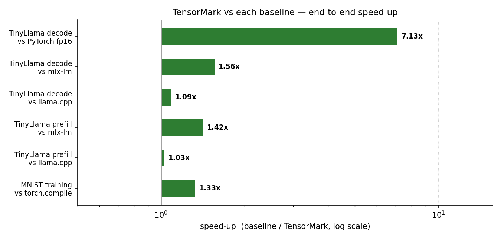
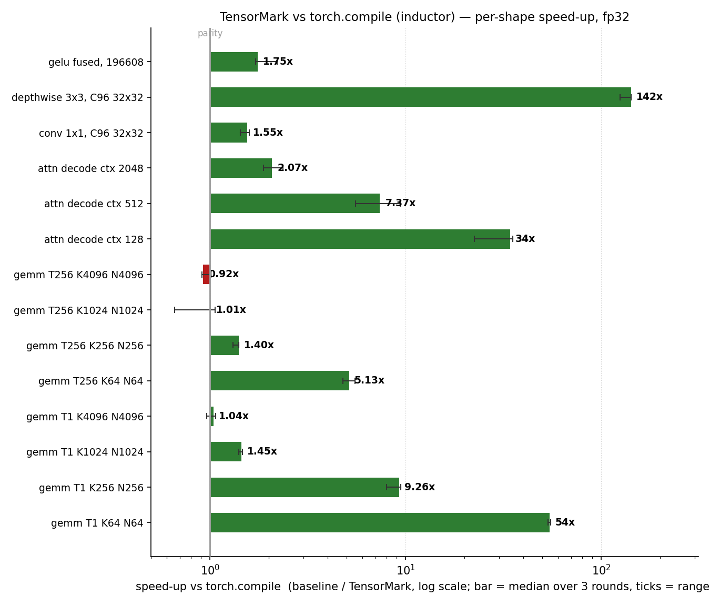

# TensorMark

**A focused C++23 neural engine with a PyTorch-compatible Python subset, built
for Apple Silicon.**


---

**Jump to:** [What this is](#what-this-is) · [How it performs](#how-it-performs) ·
[Quick start](#quick-start) · [Testing](#testing) · [Alongside PyTorch](#alongside-pytorch) ·
[Where things live](#where-things-live) · [Migrating to it](#migrating-to-it) ·
[The LLM inference engine](#the-llm-inference-engine) · [License](#license)

---

## What this is

TensorMark trains neural networks and serves LLM inference on Apple Silicon. It
is two things in one repository:

1. **A neural engine** — header-only C++23, tuned for the unified-memory
   architecture of Apple's M-series chips.
2. **A PyTorch-compatible Python layer** — swap `import torch` for
   `import tensormark.torch as torch` and keep the same training loop, backed by
   the native engine.

It is developed and validated on an Apple M1 MacBook with **8 GB of unified
memory**, and that machine is the design brief. On unified memory there is no
separate GPU RAM to hide in: the engine shares every gigabyte with the operating
system, the browser, and your Python process. TensorMark treats that as a
first-class constraint — bounded allocations, buffer recycling, bandwidth-aware
kernels — rather than an afterthought.

- **Zero heavyweight dependencies** — no CUDA, no external accelerator runtime;
  NumPy is the only Python runtime dependency.
- **LLM inference on-device** — **decode** (one token at a time, on the GPU via
  Metal, Apple's GPU API) and **prefill** (the whole prompt at once, split across
  CPU and GPU), over five block formats: `Q4_0`, `Q8_0`, `Q4_1`, `Q5_K` and
  `Q6_K`. In the `_0` family each block of 32 weights carries one fp16 scale, so
  `Q4_0` spends 4.5 bits per weight and `Q8_0` 8.5; `Q4_1` adds a per-block
  minimum beside the scale, which is what makes it 5 bits. K-quants use a
  256-value super-block carrying an fp16 super-scale plus per-sub-block scales.
  K-quants are never widened — a GGUF (llama.cpp's model format) tensor lands in
  `.tmq`, this repository's container for one model's weights, bit-exactly, at
  its source byte width.
- **Verified numerics** — every kernel is gated against independent NumPy and
  PyTorch references.

**Scope.** Apple Silicon macOS with CPython 3.10+; the native build depends on
Accelerate (Apple's system BLAS framework), so Linux and Windows need porting, and
installation is from source
rather than PyPI. The compatibility layer covers a named PyTorch subset —
`from_numpy`/`rand`/`randn`/`zeros`, `Linear`, `ReLU`, `Sequential`, `MSELoss`,
`SGD`, `Adam`, `backward`/`item`, `no_grad` — and that list is the contract,
spelled out in the module docstring of
[`tensormark/tensormark/torch.py`](tensormark/tensormark/torch.py) and rendered
with signatures in the generated [API reference](docs/API.md). Read one of them
before porting code, because the gaps are ordinary rather than exotic: no `@`,
no general `+`/`-` on tensors, no `ones`, no `tolist`, no indexing a
`Sequential`, and none of `torchvision`, `DataLoader`, CUDA or distributed
training. Arbitrary PyTorch programs will need edits. Gradients in that layer
are NumPy arrays.

TensorMark **complements** PyTorch and the llama.cpp/Ollama ecosystem; it does
not replace them. See [Alongside PyTorch](#alongside-pytorch).

---

## How it performs

All measurements are paired same-window A/B on **Apple M1 MacBook, 8 GB unified
memory, macOS** — one machine and session window, interleaved rounds, and the same
weights on both sides wherever a row does not say otherwise. A *window* is one
uninterrupted period in which both legs are measured alternately, because this
machine's effective speed drifts: ambient load and GPU clock state move a figure by
tens of percent between windows, so only comparisons made inside one window are
quoted. `speed-up` is the baseline divided by TensorMark, so **> 1.00 means
TensorMark is faster**. Each chart
draws that ratio as a horizontal bar on a log axis, with a vertical line at 1.00
labelled *parity* and a whisker spanning the round-to-round range where the evidence
records one. The rows do not share one execution path, so each table states its own
conditions instead of inheriting a blanket claim.

### End-to-end

Conditions differ per row. The `llama-bench` rows (llama.cpp's benchmark binary) run
on the GPU on both sides: its Metal backend (the backend string it reports, `BLAS,MTL`,
at 4 CPU threads) against TensorMark's GPU-resident decode chain and hybrid GPU/CPU
prefill split. The MNIST row is CPU on both sides — a small
convolutional net (CNN) over the handwritten-digit set — the engine against
`torch.compile`/inductor, full 60k training split, batch 128, Adam, 469 steps per
epoch, compile cost excluded. Architecture and batch are matched on both sides, but
the engine's step additionally applies ±2 px shift augmentation and 5e-4 decoupled
weight decay on a warmed-up cosine learning-rate schedule, so it does the strictly
larger amount of work per sample.



| what | baseline | TensorMark | speed-up |
|---|---|---:|---|
| MNIST CNN, full 60k epoch | 1,607 samples/s (`torch.compile`) | 2,134 samples/s | **1.33×** |
| TinyLlama prefill, 2000 tok | 757.1 tok/s (`llama-bench`) | 777.0 tok/s | **1.03×** |
| TinyLlama prefill, 2000 tok | 549.1 tok/s (`mlx-lm`) | 777.0 tok/s | **1.42×** |
| TinyLlama decode, 128 tok | 65.9 tok/s (`llama-bench`) | 71.9 tok/s | **1.09×** |
| TinyLlama decode, 128 tok | 46.0 tok/s (`mlx-lm`) | 71.9 tok/s | **1.56×** |
| TinyLlama decode, 64 tok | 10.65 tok/s (PyTorch fp16 on MPS) | 75.9 tok/s | **7.13×** ‡ |

**Rows 1–5 are one campaign; row 6 — the `‡` row — is a second one.** Rows 1–5 are
medians over one same-window measurement — 3 rounds per leg, except TensorMark's
prefill leg, which recorded two — each stack running the configuration a user
would actually get on this machine's GPU: `llama-bench` on its Metal backend,
`mlx-lm` on its own 4-bit pipeline, against TensorMark's hybrid GPU/CPU prefill
split and GPU-resident decode chain. Row 6 is
**a different campaign** — two rounds, mean of runs — in which each framework runs
its own production configuration, so weight precision differs **by design**: `Q4_0`
against PyTorch's fp16 weights on MPS (Metal Performance Shaders, PyTorch's GPU
backend on macOS), which is the comparison a user actually faces. The gap
decomposes as 3.56× fewer weight bytes × 2.00× engine efficiency: `Q4_0` moves
0.62 GB of weights per token against fp16's 2.20 GB (16 bits ÷ 4.5 bits = 3.56), and
the engine sustains 47.0 GB/s of the ~51 GB/s of DRAM achievable in that window,
against PyTorch's 23.4 GB/s. 3.56 × 2.00 = 7.13.

- Read row 6's **ratio**, not its absolute `tok/s`: 75.9 and row 4's 71.9 are the
  same engine in different windows. Run length is not the cause — both lengths
  re-measured inside one window agree to within noise.
- The `llama-bench` and `mlx-lm` rows run the same TinyLlama checkpoint on the GPU
  on both sides (`Q4_0` against MLX 4-bit, group 32; `tensormark/bench_mlx.py`
  drives the MLX leg). The `llama-bench` decode margin has read 1.07×–1.13×
  across the windows measured — it follows GPU clock state, so read it as a
  narrow edge that moves, not as a fixed multiple. The `mlx-lm` rows were added
  2026-09-17, in the same window as the rows around them.

### Per-shape kernels vs `torch.compile`

All fp32, both sides on the **CPU at 4 threads**, the baseline being `torch.compile`
with the inductor backend. Shape legend: `T` = rows (tokens), `K` = contraction dim,
`N` = output columns — a `gemm`/GEMM is one dense matrix multiply, `T1` its
single-token GEMV (matrix-vector) case; `ctx` = cached sequence length in attention decode,
attention shape as `heads × head_dim`; `C96 32×32` = 96 channels over a 32×32 spatial
map.



| op (shape) | torch.compile ms | TensorMark ms | speed-up (range over rounds) |
|---|---|---|---|
| gemm T256 K4096 N4096 | 15.7537 | 17.1253 | 0.92× (0.91–1.01 †) |
| gemm T256 K1024 N1024 | 0.4326 | 0.4279 | 1.01× (0.66–1.06 †) |
| gemm T256 K256 N256 | 0.0428 | 0.0306 | 1.40× (1.31–1.40) |
| gemm T256 K64 N64 | 0.0154 | 0.0030 | 5.13× (4.77–5.50) |
| gemm T1 K4096 N4096 (decode GEMV) | 1.7130 | 1.6465 | 1.04× (0.96–1.07 †) |
| gemm T1 K1024 N1024 | 0.0399 | 0.0275 | 1.45× (1.40–1.46) |
| gemm T1 K256 N256 | 0.0176 | 0.0019 | 9.26× (8.00–9.42) |
| gemm T1 K64 N64 | 0.0109 | 0.0002 | 54.50× (53.50–55.00) |
| attn decode ctx 2048 (12 heads × 64 dim) | 1.5153 | 0.7304 | 2.07× (1.88–2.36) |
| attn decode ctx 512 (12 heads × 64 dim) | 0.8723 | 0.1184 | 7.37× (5.54–9.40) |
| attn decode ctx 128 (12 heads × 64 dim) | 1.0209 | 0.0299 | 34.14× (22.49–35.23) |
| depthwise 3×3, C96 32×32 | 4.2053 | 0.0297 | 141.59× (124.87–142.14) |
| conv 1×1, C96 32×32 | 0.0326 | 0.0210 | 1.55× (1.43–1.59) |
| gelu fused, 196,608 elems | 0.3623 | 0.2074 | 1.75× (1.71–2.20) |

Both sides run on byte-identical shared inputs and pass a checksum gate at max rel
deviation 6.9e-04 — the same arithmetic summed in a different order (fp32
reassociation), not a different computation.

**† this row's result flips between rounds.** The parenthetical range is the ratio
recomputed round by round, so `†` marks the three rows whose range straddles 1.00:
their order of finish is settled by machine state, not by the code. Read those as
parity, and trust a row only when its range sits wholly on one side of 1.00.

Which side is the noisy one — the one whose spread is doing the work — **differs per
row**, so read the range row by row. Three examples: on `gemm T1 K4096 N4096` the
baseline is the steady side (0.6% spread) and TensorMark is not (10%); on
`gemm T256 K1024 N1024` a single 56%-slow TensorMark round is the whole story, and on
medians that row reads 1.01×; on `attn decode ctx 512` the baseline carries the widest
spread here (67%), yet its ratio still sits entirely above 1.00. Only the three `†` rows
cost a reader anything, and all three are ties.

**Where TensorMark does not win.** The three GEMM rows marked † above are
parity, and they are the rows least distorted by dispatch overhead — so on the
large-op comparisons the honest reading is parity, not a win. Decode against
`llama.cpp` is a narrow margin (1.13× in the window quoted) for the same
structural reason: both engines are DRAM-bandwidth-bound. The many-fold factors
sit on small shapes, where the
baseline's per-call dispatch and codegen overhead dominates its measured time;
the one large genuine kernel difference is the `141×` depthwise row (NEON, ARM's
SIMD unit, depthwise vs the compiler's generic codegen). Equal-precision CPU prefill has
**no stable winner** between the two engines across sessions, so no factor is
quoted for it. All 14 kernel rows are fp32, on one machine, at these shapes —
workload- and machine-specific, with no claim of general advantage.

**Provenance.** Every figure here is derived, not transcribed.
[`docs/perf_evidence.json`](docs/perf_evidence.json) holds the per-run values and
the statistic taken over them, regenerated from the raw files by
`tensormark/collect_perf_evidence.py`; the underlying probe documents are in
[`docs/probes/framework_compare/`](docs/probes/framework_compare/), so every
derivation can be followed run by run. `tensormark/check_readme_perf.py` re-checks
this section against that file and flags anything it cannot account for;
`tensormark/render_readme_perf.py` prints these tables from it. Logs are in
[`docs/BENCHMARKS.md`](docs/BENCHMARKS.md). Claims that could not be reproduced
from the raw files were removed rather than left standing.

---

## Quick start

Install the Python layer (macOS on Apple Silicon; CPython 3.10+):

```bash
git clone https://github.com/weoptimizetech/tensormark.git
cd tensormark
python3 -m venv .venv && source .venv/bin/activate
python -m pip install ./tensormark        # the Python layer; the C++ engine builds below
```

The throughput figures above come from the **native C++ engine**, which builds
separately — see [Build and run](#build-and-run). Not one of them runs through
the Python layer: the engine needs no Python, and the Python layer needs no model
file. Installing TensorMark does not replace your PyTorch installation or change
what `import torch` loads.

```python
import numpy as np
import tensormark.torch as torch

torch.manual_seed(7)
x = torch.from_numpy(np.array([[-1, 0], [0, 1], [1, 0], [0, -1]], dtype=np.float32))
y = torch.from_numpy(np.array([[-1], [2], [1], [-2]], dtype=np.float32))

model = torch.nn.Sequential(torch.nn.Linear(2, 1))
loss_fn = torch.nn.MSELoss()
optimizer = torch.optim.SGD(model.parameters(), lr=0.1)

for step in range(200):
    optimizer.zero_grad()
    loss = loss_fn(model(x), y)
    loss.backward()
    optimizer.step()

print(f"Final training loss: {loss.item():.6f}")
```

`Final training loss: 0.000000` — not a broken example: `y = x₁ + 2x₂` is exactly
linear in the inputs, so SGD drives the loss to zero and lands on weights
`[1.00, 2.00]`, bias `0.00`. Reproducible run to run.

### Build and run

Two runtimes are in play below, and the order matters: `examples/from_pytorch.py`
`import`s the package, so it needs the virtualenv above, while everything else here
is a shell command — `build_llama.sh` never invokes Python, and the other examples
drive the compiled binary from the standard library. **Create the virtualenv first**,
then run everything from the repository root.

The native engine compiles with the Xcode Command Line Tools
(`xcode-select --install`) — it needs `clang++`, Metal and Accelerate. Binaries
land in `tensormark/build/`; the fetched model and tokenizer land in
`tensormark/data/tinyllama/`, which is where the gates and examples look for them.

```bash
./tensormark/build_llama.sh                          # builds every binary below, converters included
python3 examples/fetch_model.py                      # TinyLlama 1.1B: ~2.2 GB download → 590 MB Q4_0 .tmq (this repo's weight container) + tokenizer

./tensormark/build/hybrid_bench <model.tmq> <tokens> <rounds>    # prefill throughput, JSON per round
```

`hybrid_bench` takes 512–2048 tokens and at least 2 rounds — the controller compares
arms, so a shorter prompt or a single round is refused rather than measured.

`build_llama.sh` also builds the numerics and controller gates (`test_gbnf`,
`test_hybrid`, `test_llama_gpu_stack`); they are described under
[Testing](#testing).

`fetch_model.py` fetches that one model from Hugging Face. `examples/fetch_models.py`
reads [`examples/models.json`](examples/models.json) instead — a manifest of where
each model may come from, tried in order:

| source | note |
|---|---|
| **a folder you already have** | local or on the local network — the default first choice, and the only one that costs no bandwidth |
| **Ollama** | resolved against `ollama list` at plan time rather than a hardcoded tag |
| **Hugging Face** | the last resort |

So a machine that keeps its models on a share never downloads the same bytes twice.
`--plan` prints what it would do, and from where, without doing it. The manifest also
records **why** each file is there, so `tinyllama-1.1b-chat-v1.0.Q4_0.gguf` reads as
the baseline instrument `bench_all.sh` measures against, rather than as a spare copy
of the `.tmq`.

With no arguments at all it opens an interactive chat on the best model present —
Qwen3.8-4B **Q6_K** when it is on disk, then that model's own Q4_0, then Bonsai-4B TQ2,
then the small checkpoints a clone is likeliest to have. The order leads with quality:
Q6_K is the better answer, ppl 5.77 against 6.19 for the Q4_0 derived from it on the
same corpus. It is also the slower and the larger one. On an 8 GB M1 the Q4_0
checkpoint decodes at 17–18 t/s and peaks at 3.40 GB at `TM_CTX=4096`; the Q6_K source
decodes at 11 t/s and peaks at 4.50 GB there, and 5.41 GB at the context the box sizes
for itself — which against ~3.9 GB of free memory is the swap-thrash regime. That is
why the CLI also defaults `TM_CTX` to 4096: the smaller cache is what makes the better
answer usable as a default at all. Neither checkpoint gets a GPU token lane — both are
hybrid models, which the engine runs on the CPU by policy — so that 1.6× is a real,
CPU-bound difference. The bare command returns the accurate one; `-m` the Bonsai-4B TQ2
file returns the fast one.

One caution that comes with leading with a 4 GB pack: the engine wires (`mlock`s) the
weights so they stay resident, and on a busy 8 GB host that lock can be **refused** —
the engine says so on stderr and decoding then falls to ~0.1 t/s, because every weight
read comes off disk instead. Measured back to back on the same binary and pack: lock
refused, 4 tokens in 37.68 s; lock granted, 4 tokens in 0.49 s. If a session is
unexpectedly crawling, look for `mlock(...) refused` in the banner before suspecting
anything else, and reach for Bonsai-4B TQ2 (1.07 GB), which does not have this exposure.
A clone ships no weights at all, so the fetch step
above is what puts a model there in the first place: it downloads TinyLlama, which then
becomes the default. It prints the model and tokenizer it resolved. Interactive mode
reads stdin, so redirect it
(`</dev/null`) or use the `--oneshot` form below when nothing is attached:

```bash
./tensormark/build/llama_chat_metal
```

Both are found relative to the working directory and then to the binary, so that
command works from the repository root, from `tensormark/`, or from anywhere else;
`-m` and `-t` override one half each. Single-shot completion, greedy-deterministic,
printing only the completion:

```bash
./tensormark/build/llama_chat_metal --oneshot \
    -m tensormark/data/tinyllama/tinyllama_q40.tmq \
    -s "You are terse." -n 64 -p "Name the primary colors."
```

| flag | meaning |
|---|---|
| `-m` / `-t` | model `.tmq` and tokenizer — both defaulted, and neither required |
| `-s` / `-n` / `-p` | system prompt, token budget (default 1024), prompt (`-f <file>` reads one from disk) |
| `-G` | constrain sampling to a GBNF grammar — [llama.cpp's notation](#the-llm-inference-engine) for a grammar over bytes |
| `--oneshot` | print only the completion (greedy; no banners or stats) |
| `--batch` | line protocol on stdin/stdout, for driving from another process |
| `--quiet` | suppress ack and stat lines in batch mode |
| `--think` | keep the model's reasoning trace on a checkpoint that has one (Qwen3.5/3.8); the default opens an **empty, pre-closed** block so the answer starts immediately |
| `--sampling` | start with the sampler on (temperature/top-k/top-p) instead of the default greedy; `/greedy` toggles the same switch live |
| `--greedy` | force the default explicitly; harmless unless an earlier flag turned sampling on |
| `--embed` | print the prompt's pooled embedding and exit — no generation, no chat template |

With no flag set it is an interactive chat in **greedy** (argmax) mode, which is the
default because the sampler measurably loses the kind of task a model this size gets
asked to do — see *Sampling is the weak point…* below. `--sampling` turns temperature
0.7 / top-k 40 / top-p 0.9 back on. Under `-G` every sampled token extends a string the
grammar still accepts, so the output is structurally valid by construction — a small
model can be trusted to emit a JSON object or a tuple list.

Replies start with the answer rather than with the model's reasoning. Qwen3.5/3.8
checkpoints think before they speak: left alone the model emits `<think>`, works
through a trace, and only then answers — on this box 60–80 tokens, several seconds of
silence, charged to the reply's budget as well. The chat front-end opens the assistant
turn with an *empty, pre-closed* reasoning block instead, which is exactly what the
official template's `enable_thinking=false` does; measured on the 4B, a 200-token
reply spent 281 characters on reasoning with the plain header and none with the
pre-closed one. `/think` (interactive or `--batch`) puts the trace back at runtime,
and `--think` starts that way.

Sampling is the weak point of a 4B checkpoint, which is why greedy is the default now
rather than a flag you have to know about. On a five-turn counting dialogue the sampled
arm produced a confidently wrong answer on the final reasoning turn (in both runs we
have), while the greedy arm answered every turn consistently and greedy with thinking
reasoned through it in a trace without changing the answer; thinking alone, with
sampling still on, stayed muddled. Greedy is not free either — a
list-shaped answer can cycle, which is what the serving path's repeat penalty exists to
break, and that penalty is itself a trade: at 1.15 over 64 tokens it fixes a looping
author list and breaks a counting one. Thinking charges 2–3× the tokens to the reply
budget.

Which 4B is a measured question, not a size one. On a four-turn dialogue that
requires tracking what has already been counted — 1–10, then 30–40, then 15–25, then
"which numbers were never counted?" — greedy with thinking on, the two checkpoints
split cleanly. The official Qwen3.5-4B holds all three ranges and answers right both
ways (11–14, 26–29). The shipped Qwen3.8-4B distill, at Q4_0 and at its Q6_K source
precision alike, drops one of the three ranges from its own reasoning — its trace
re-lists only two of them — and then computes the gaps over that truncated union,
returning numbers it had just counted (e.g. 20–29 or 31–39, depending on which range
it lost). A "restate the relevant facts first" system prompt does not change it, and
neither does the precision: this is a working-memory failure in tracking three ranges,
not arithmetic and not quantization. The tables turn on a task that needs no tracking:
the official spends a full 1024-token budget looping four author names where the
distill answers straight, at 16.6–16.9 t/s against 8.6–14.7 in that window. So the
default stays the distill for brevity, and `-m tensormark/data/qwen35-4b/qwen35_4b_q40.tmq`
picks the checkpoint that tracks a conversation better.

To serve it over HTTP instead, for clients that already speak Ollama's API:

```bash
python3 examples/from_ollama.py --port 11435
curl -s localhost:11435/api/chat \
    -d '{"messages":[{"role":"user","content":"Name two primary colors."}]}'
```

It resolves the same model and tokenizer the CLI does and streams each piece as the
engine decodes it. A client may send the whole conversation every turn — the stateless
shape those APIs use — and the shim then loads only the turns the engine's cache does
not already hold, so history is read once instead of once per turn: **1.95×** over
three turns (17.78 s → 9.14 s) with not one reply changed, because each finished turn
is first put back into the exact form a replay would build (`docs/BENCHMARKS.md`).
The same turns in a busier window measured **2.69×** (24.62 s → 9.16 s), and the whole
difference is the replay leg: it moved 38% between the two windows while the reuse leg
moved 0.2%, because a full replay re-prefills every turn and reuse does not.
`TM_SHIM_NO_REUSE=1` restores a full replay per request.
`/api/generate`, `/api/tags`, `/api/ps` and Ollama's two embedding spellings answer
too (`/api/embeddings`, which takes one `prompt`, and `/api/embed`, which takes an
`input` — a string or a list).

The model does not stay in memory just because the server is up. After 300 s with no
request the engine process is **reaped** — an unload has to be exactly that, because
its weights come back only when the process exits — and the next request reloads
them transparently. `--idle-ttl` changes the delay (`0` pins the model), a request
can override it with Ollama's `keep_alive` (`0` unloads as soon as that reply is
sent, `-1` pins the model), and `GET /api/ps` reports what is loaded and when it is
due to go.

`--lanes 2` puts the machine's two compute units behind the one endpoint: an engine
process pinned to the GPU-preferred lane and one to the CPU, each request going to the
lane predicted to finish it first. That is worth doing because the two engines do not
contend for one memory pipe — measured on an M1/8 GB, two concurrent decodes aggregate
to **95.75 tok/s against 76.97 on the better single lane (1.24×, each lane keeping
~2/3 of its solo rate)**, while a stream probe alongside the GPU chain reads a hot file
at 61 GB/s. It is not free: a second lane costs a second set of activations and KV, so the
pool **parks** the extra lane whenever it stops beating one lane by 5%, and re-probes it
a minute later. What it deliberately does *not* do is llama.cpp's `-ngl` layer split:
for one token the layers are a chain, so handing some to each engine is the sum of both
their times, not a split of the work.

Model weights are not bundled. `.tmq` is this repo's container for one model —
per-tensor quantized weights plus shape metadata. The tokenizer stays a separate
file beside the weights and the engine takes it from there — either a SentencePiece
`tokenizer.model`, or the byte-level BPE (byte-pair encoding) sidecars
(`<stem>.tokenizer.{vocab,merges,special}.json`) that `convert_gguf` writes for a
model whose GGUF carried one. `fetch_model.py` fetches both.

```bash
./tensormark/build/convert_tmq <src.safetensors> <out.tmq> q80|q40 [asis|transpose]
```

`q40`/`q80` select the weight precision (`Q4_0` / `Q8_0`); `<src>` is a `safetensors`
file, Hugging Face's tensor format. The fourth argument is
the source layout and **defaults to `transpose`**: store `(out, in)` with the
quantization blocks along `in`, correct for GPT-2's `Conv1D`-style `(in, out)`
weights. Llama and Hugging Face `nn.Linear` weights are already `(out, in)` —
pass `asis` for those, or they land in the container transposed. `<src>` may be a
comma-separated list of HF shards.

`tensormark/build/convert_gguf` bridges the GGUF format llama.cpp and Ollama use
into `.tmq` (bit-exact `Q4_0`/`Q8_0`/`Q4_1`/`Q5_K`/`Q6_K`, tokenizer exported).

## Testing

Every kernel and every end-to-end figure in this README is gated against
independent NumPy and PyTorch references on byte-identical shared inputs. Each row
below is one runnable unit that prints its own verdict, so a failure names the claim
it broke.

| gate | what it establishes |
|---|---|
| `tensormark/bench_all.sh` | kernel and end-to-end numerics vs NumPy/PyTorch; regenerates the evidence behind the tables above (`python3 tools/gen_benchmark_figs.py` redraws the charts from it). The kernel legs are self-contained; a leg whose inputs are missing — a local `mnist/` copy, a fetched model — prints SKIP and its reason, rather than failing or reporting nothing |
| `build/test_gbnf` | the grammar engine's accept/reject boundary (run by `build_llama.sh`, so a local build fails if it does) |
| `build/test_hybrid` | the prefill controller against a simulated load model |
| `build/test_llama_gpu_stack <model.tmq>` | the Metal decode chain against the CPU reference |
| `build/test_llama_attn_gate` | the `attn_output_gate` split, on a quantized fixture it writes itself — both gate layouts, and the 64-byte overrun that once SIGSEGV'd on long prompts (see below) |

`attn_output_gate` is worth a sentence of its own, because it is a shape the textbook
transformer does not have. In the hybrid architectures `q_proj` is twice as wide as
the query: it also emits a gate that scales the attention output by `sigmoid(gate)`
before `o_proj`. A checkpoint may store that gate's rows interleaved per head, or as
a second half of the projection, so the gate is built for both layouts. It is also
the write that once ran one row past its buffer and SIGSEGV'd on long prompts — a
64-byte overrun sitting just past a page-rounded buffer, which a plain build catches
only by luck (~1 run in 4; it caught 0 of 12 in one measured run). CI therefore
builds this gate instrumented (`TM_ASAN_GATES=1`), after probing that the host's
sanitizer reports at all.

The grammar, structured-output, embedding, serving and cache-reuse paths have eight more,
run together by `./tensormark/run_grammar_gates.sh` (CI runs it too):

| gate | what it establishes |
|---|---|
| `tensormark/test_grammar_switch.py` | the engine's `/grammar` protocol |
| `tensormark/test_jsonschema_to_gbnf.py` | a JSON Schema compiles to a grammar **and the reply parses and validates** — the property that matters, and the one a parse-only assertion misses |
| `tensormark/test_embeddings.py` | embedding length against `config.json`, unit norm, bit-identical repeat, distinct vectors for distinct text, CLI ≡ protocol; with a trained model, a related pair scores above an unrelated one |
| `tensormark/test_shim_grammar.sh` | the same path over HTTP |
| `tensormark/test_shim_idle.sh` | the serving lifecycle, which no reply can show: the engine is **reaped** after its idle TTL (checked by PID, so an unreaped zombie fails too), a later request reloads it on a fresh PID, `keep_alive` 0 unloads at the end of a reply and `-1` pins the model past the TTL, and reloads leak no stderr temp files |
| `tensormark/test_shim_lanes.sh` | the lane pool: both compute units resident behind one endpoint (`/api/ps` names each lane), a 6-request batch served by both, a single request still answered from the pool, and a retreat phase that forces the extra lane to park and checks the pool keeps serving on what is left. With a real model it also asserts the batch beats `--lanes 1` by **≥1.10×** in the same window (measured **1.39–1.40×**); on CI's random-weight fixture the ratio is printed rather than asserted, because a reply there costs about a millisecond and the ratio would be measuring process startup |
| `tensormark/test_chat_rewind.py` | the engine-side primitive that makes a cached conversation reusable at all: rewinding to the boundary the engine reports and re-prefilling the last turn **from text** reproduces the cache a full replay builds, byte for byte (the naive version was 31% faster and answered different questions — see the serving paragraph above) |
| `tensormark/test_shim_reuse.py` | the shim's whole conversation path over HTTP, as the client drives it: three turns with reuse and three without, one window, every reply hash identical, the debug line showing reuse actually fired, and — on a real model — the fast leg beating the full replay by **≥1.25×** (measured **1.80×–2.69×** across runs: the low end inside the fuller gate suite, the high end in a loaded window — what moves between them is the full replay, which re-prefills every turn). The reference leg *is* the pre-reuse behaviour, so this gate cannot pass by measuring the same code twice |

The grammar-facing gates among them share one assertion: a grammar the engine rejects is
reported as a failure instead of quietly decoding unconstrained.

**Skipping is a result, not a pass.** Each gate exits 77 — the conventional
"could not run" code, which a runner must not read as a failure — when the model or
the engine binary is absent, and the runner prints why. Nothing skips in CI for want of
a model: `tensormark/gen_tiny_llama.py` writes a tiny random-weight `.tmq` whose
vocabulary is read out of the real tokenizer, and it is the grammar mask — not the
weights — that decides which tokens are reachable. The assertion that a reply both
**parses and validates** therefore runs on every push, rather than only where a
590 MB checkpoint happens to exist. Because a gate that could not run has proved
nothing, CI sets `TM_GATES_REQUIRE=1`, which turns a skip into a failure. One check
is deliberately skipped on the fixture, because it tests something random weights
cannot have: the embedding gate's related-vs-unrelated comparison.

The Python package is a native extension (built by `setup.py` with pybind11 and
Accelerate), so `pip install` needs the same compiler toolchain as the engine. `-I`
isolates the interpreter from `PYTHONPATH`, so the smoke test imports the installed
package rather than the source tree:

```bash
python -m pip install build 'setuptools>=77' wheel pybind11
python -m unittest discover -s tensormark/tests -p test_packaging.py -v
python -I tensormark/tests/smoke_installed.py
```

Package tests cover extension loading, source archives, version agreement, and the
installed-package smoke test; the supervised-fine-tuning (SFT) path has its own
gate, run from `tensormark/` once the extension is built (`python3 tests/test_sft.py`
— graph parity against the numpy reference, padding exactness, `ignore_index`
loss/grad correctness, export round-trip).

## Alongside PyTorch

We value PyTorch and its ecosystem. TensorMark is a complementary project with a
narrower scope, not a replacement, and the compatibility layer is a small subset
rather than a clone — some details differ by design (gradients are NumPy arrays,
for instance). Where a program steps outside that subset, use PyTorch.

## Where things live

| path | contents |
|---|---|
| `tensormark/*.h` | the engine — header-only C++23: `llama.h`, `metal_llama.h`, `quant.h`, `attention.h`, `gemv_pool.h`, and the tensor/autograd core |
| `tensormark/*.cpp` | the `convert_gguf` and `convert_tmq` weight converters, the chat front-end, and the numerics gates and benches `build_llama.sh` compiles |
| `tensormark/tensormark/` | the Python package, including `torch.py` — the PyTorch-compatible layer |
| `tensormark/tests/` | packaging and engine tests |
| `examples/` | runnable PyTorch, llama.cpp and Ollama migration examples, plus `three_capabilities.py` and the `models.json` manifest with its `fetch_models.py` fetcher |
| `tools/` | benchmark figure rendering and the Apple Neural Engine benches |
| `docs/` | `BENCHMARKS.md` (the measurement log behind the tables), `API.md` (the Python API reference, generated and drift-gated), `ANE.md` (what the Neural Engine will and will not do here), and the raw sweep outputs |

`examples/three_capabilities.py` puts grammar, structured output and embeddings
side by side on a single model, and its model-free half runs before you have a
checkpoint. [`examples/models.json`](examples/models.json) records where each
model may come from and which of its files are instruments rather than spares.

The LLM engine is described in more detail under
[The LLM inference engine](#the-llm-inference-engine).

---

## Migrating to it

You already have a workflow; TensorMark slots into it without asking you to
relearn anything. Runnable examples live in [`examples/`](examples/).

| you use today | try this first | example |
|---|---|---|
| PyTorch training loops | swap `import torch` → `import tensormark.torch as torch`; the loop is unchanged | [`examples/from_pytorch.py`](examples/from_pytorch.py) — same loop, both frameworks, loss curves side by side |
| `llama-cli` / `llama-bench` | `tensormark/build/llama_chat_metal --oneshot` (greedy) and `tensormark/build/hybrid_bench`; existing GGUF files convert with `tensormark/build/convert_gguf` | [`examples/from_llama_cpp.md`](examples/from_llama_cpp.md) — flag mapping + model conversion |
| `ollama run` / Ollama HTTP API | point existing clients at a local Ollama-compatible endpoint backed by the engine; a `"schema"` or `"grammar"` field in the request constrains decoding, so a small model returns a document that validates | [`examples/from_ollama.py`](examples/from_ollama.py) — `/api/chat`, `/api/generate`, per-piece streaming, grammar-constrained output |
| (no model yet) | `python3 examples/fetch_model.py` — downloads TinyLlama 1.1B Chat (~2.2 GB) and converts it to Q4_0 `.tmq` | [`examples/fetch_model.py`](examples/fetch_model.py) |

---

## The LLM inference engine

A header-only C++23 engine (`tensormark/llama.h` and companions) for Llama-family,
dense Qwen2 and Qwen3.5 models: GPU-resident decode with cooperative Metal GEMV
kernels, and a **hybrid prefill split** driven by a self-tuning two-loop
controller.

What it covers:

| | |
|---|---|
| **weight formats** | `Q4_0`, `Q8_0`, `Q4_1`, `Q5_K`, `Q6_K` block quantization, plus `F16`/`BF16`/`F32` tensors (half, bfloat16, single precision). `Q4_0` and `Q8_0` also take a grouped-GEMV fast path; the other layouts decode through the per-weight path |
| **architectures** | `llama` (Llama / TinyLlama family), dense `qwen2` (Qwen2.5, grouped-query attention), and `qwen35` (Qwen3.5, plus the Qwen3.8 distills reusing its geometry). A qwen35 checkpoint's own `layer_types` interleaves full attention with gated DeltaNet layers — linear attention, whose state is a fixed-size recurrence instead of a key/value cache that grows with the prompt — and those layers are served on the CPU. A per-token Metal lane for them was built and measured, then retired from the engine: it ran at 0.6–0.9× the CPU lane's throughput and decoded wrongly on K-quant checkpoints, which is what the shipped qwen35 checkpoints are |
| **decode lanes** | Q4_0 GPU chain (default); an fp16 lane (`TM_DECODE_F16=1`) built for equal-precision comparison against PyTorch fp16 |
| **prefill** | GPU/CPU hybrid split tuned by an extremum-seeking controller (ESC). A prefill path on the Apple Neural Engine (ANE) was built and measured, then retired from the engine — on this silicon the ANE cannot add to the hybrid (`docs/ANE.md`) |
| **KV cache** | one cache per conversation, and it can be rewound: `/pos`, `/turnpos` and `/rewind <n>` on the batch protocol expose where it ends and move it back there, which is what lets a served conversation load only the turns it has not seen (`docs/BENCHMARKS.md`) |
| **sampling** | greedy (argmax) is the default; `--sampling` restores temperature 0.7 / top-k 40 / top-p 0.9, and `/greedy` toggles live. The KV cache persists across chat turns |
| **embeddings** | `--embed -p <text>`, `/embed <text>` on the batch protocol, or `Engine.embed(text)` in `tensormark/tmchat.py`: the mean of the final-layer hidden state over the prompt's positions, L2-normalised, so cosine similarity is a plain dot product. Raw text — no chat template, which is a generation concern |
| **constrained decoding** | The compiled grammar is a pushdown automaton over the vocabulary, masked through a byte trie with per-state allowed-set caching. Reachable as `-G <file.gbnf>` on the CLI and as a `"grammar"` or `"schema"` field on the Ollama-shaped endpoint, switchable per request without a model reload — the vocabulary tables are built once, so a switch costs a grammar parse, not a model load |
| **schema → grammar** | A JSON Schema compiles to that grammar (`tensormark/jsonschema_to_gbnf.py`): keys fixed in declaration order, required keys mandatory, arrays bounded, no recursion — so the document must *terminate*, instead of the model free-running inside it. Verified: 5 schemas, 15/15 documents closed **and** validated against their schema |
| **memory** | fixed footprint — no CPU-side weight copy, bounded KV, designed to fit an 8 GB host running a browser |

**The hybrid prefill split** partitions each prompt's rows between the GPU
(leading rows) and the CPU (tail). The CPU runs one layer behind, reading each
layer's key/value rows as the GPU's command buffer for that layer completes. At
~2k context prefill is compute-bound, so running part of it on the CPU's AMX matrix
coprocessor (Apple's matrix unit, reached through Accelerate) alongside the GPU
beats GPU-only — but the optimal fraction
depends on machine state.

The shipped controller (`HybridSplit` in `tensormark/llama.h`) tunes that
fraction by **discrete extremum seeking**: dither it by ±δ, hold each arm for m
samples, alternate arm order so drift shifts both arms equally, and step only
when the wall-time contrast clears a hypothesis test (|Δmean| > 1.5·σ̂·√(2/m)) —
bounding the limit cycle at ±δ around the optimum. A contention-retreat probe and
a chip-pressure self-regulator wrap it, so a busy machine degrades gracefully
instead of chasing a phantom gradient.

It replaced a PI (proportional–integral) controller that regulated
`(gpu_ms − cpu_ms)/(gpu_ms + cpu_ms)`.
That map is flat across the whole optimal band at short prompts — a setpoint
inside the measurement's null space cannot be tracked into the optimum. Design
rationale and the identified system maps are in the header comments of
`tensormark/llama.h`.

---

## License

WeOptimize-owned code is licensed under [Apache-2.0](LICENSE); see
[NOTICE](NOTICE). Separately identified third-party materials retain their
applicable terms; model weights and datasets are not bundled.

Learn more at **[weoptimizetech.com](https://weoptimizetech.com)** ·
[CONTRIBUTING](CONTRIBUTING.md) · [SECURITY](SECURITY.md)
